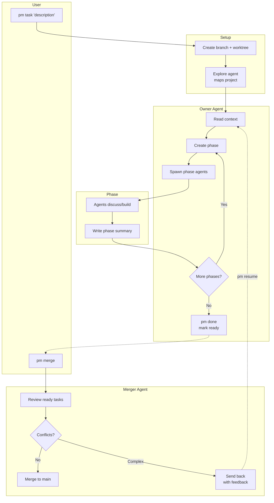
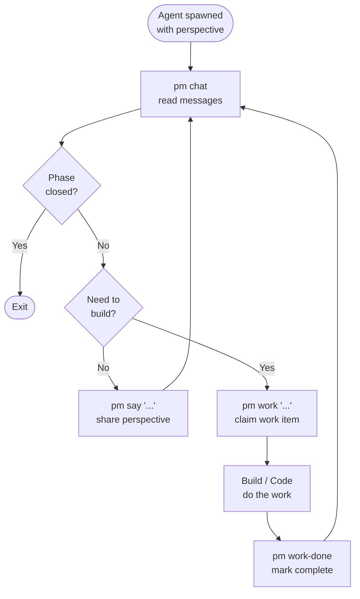

# Plasmodium

Multi-agent collaboration through bounded discussion phases.

## What is it?

Plasmodium coordinates multiple Claude instances to work on tasks together. An **owner** agent breaks work into **phases**, each with specific **perspectives** that debate and build. Phases have message limits that force convergence, and **work items** track parallel implementation.

## Quick Start

### 1. Prerequisites

Plasmodium uses git worktrees for task isolation. Your project needs:

```bash
git init                              # If not already a repo
git add -A && git commit -m "Initial" # Need at least one commit
```

### 2. Install in your project

```bash
# From your project directory
/path/to/plasmodium/pm init
```

This creates a `.plasmodium/` directory, starts the dashboard, and adds `pm` to your path.

### 3. Create your first task

```bash
pm task "Build a REST API with health and time endpoints"
```

This:
1. Creates a **git branch** and **worktree** for isolated work
2. Spawns an **explore** agent to map your project structure
3. Spawns an **owner** agent who orchestrates phases until done
4. When finished, `pm merge` reviews and merges back to main

## Core Concepts

**Owner** - Coordinates the task. Creates phases, defines perspectives, synthesizes results. Doesn't implement—only orchestrates.

**Phase** - A bounded discussion with a name, perspectives, and message limit. Phases close when the limit is reached AND all work items are done.

**Perspective** - A viewpoint assigned to an agent (e.g., "security advocate", "UX minimalist", "test-first developer"). Not fixed roles—the owner defines what perspectives each phase needs.

**Work Items** - Claimed tasks within a phase. Agents call `pm work "description"` before building, `pm work-done "summary"` when finished. Prevents duplicate work and premature phase closure.

**Worktrees** - Each task runs in its own git worktree (branch + directory). Tasks can run in parallel without conflicts. When done, the merger agent reviews and merges to main.

**Phase History** - After each phase, the owner writes a summary to `phase_history.md`. Future phase agents receive this context so they know what was already decided/built.

## Commands

### Project Setup
```bash
pm init                    # Initialize .plasmodium in current directory
pm dashboard [port]        # Start web dashboard (default: 3456)
pm reset                   # Clear all plasmodium state
```

### Task Management
```bash
pm task "description"      # Create task (spawns explore + owner agents)
pm status                  # Show all tasks, phases, agents
pm kill <task-id>          # Kill a task and its agents
```

### Merge Workflow
```bash
pm done                    # Mark task ready for merge (owner runs this)
pm merge                   # Spawn merger to review ready tasks
pm resume <task-id>        # Resume a task that needs work
```

### Phase Operations (for agents)
```bash
pm chat                    # Read current phase messages
pm say "message"           # Post to current phase
pm work "description"      # Claim a work item (announces to chat)
pm work-status             # See all work items in phase
pm work-done "summary"     # Mark your work complete
```


## Workflow Example

```
You: pm task "Add user authentication"

Owner creates phase: "Auth Design"
  Perspectives: security-advocate, ux-minimalist

  @security: "We need bcrypt, JWT tokens, rate limiting..."
  @ux: "Keep it simple - email/password, maybe OAuth later"
  @security: "At minimum: hashed passwords, secure sessions"
  @ux: "Agreed. Let's start with sessions, add JWT if needed"
  [Phase closed - 6/6 messages]

Owner creates phase: "Auth Build"
  Perspectives: backend-implementer, frontend-implementer

  @backend: "I'll handle the auth routes and middleware"
  @backend: [WORK] Starting: auth.py with login/logout/register
  @frontend: "I'll build the login form and session handling"
  @frontend: [WORK] Starting: login component and auth context
  @backend: [WORK DONE] auth.py complete with bcrypt + sessions
  @frontend: [WORK DONE] Login form with error handling
  [Phase closed - 8/8 messages, 2/2 work items done]

Owner: Task complete.
```

## Directory Structure

```
your-project/
├── .plasmodium/
│   ├── agents.json              # Registered agents
│   ├── worktrees/               # Git worktrees (one per task)
│   │   └── tk-abc123/           # Isolated working directory
│   └── tasks/
│       └── tk-abc123/
│           ├── task.json        # Task metadata (status, branch, owner)
│           ├── context.md       # Project context (from explore agent)
│           ├── phase_history.md # Summary of completed phases
│           └── phases/
│               └── ph-xyz789/
│                   ├── phase.json      # Phase config
│                   ├── messages.jsonl  # Chat log
│                   └── work.jsonl      # Work items

plasmodium/                      # The tool itself
├── pm                           # CLI entry point
├── lib/core.sh                  # Command implementations
├── dashboard/
│   ├── server.py               # Dashboard backend
│   └── index.html              # Dashboard frontend
└── prompts/
    ├── explore.md              # Explore agent prompt
    ├── owner.md                # Owner agent prompt
    ├── agent.md                # Phase agent prompt
    └── merger.md               # Merger agent prompt
```

## Why "Plasmodium"?

Like the slime mold *Physarum polycephalum*, this system has no central controller. Agents explore problems from different perspectives, communicate through shared state, and converge on solutions through bounded interaction. The owner provides structure, but the actual work emerges from collaboration.

## Flowcharts

### System Flow



### Phase Agent Flow



### Work Items

Work items prevent duplicate work and premature phase closure:

- `pm work "description"` — Claim work before starting (announces to chat)
- `pm work-status` — See who's working on what
- `pm work-done "summary"` — Mark complete when finished

Phase won't close until **all work items are done**, even if message limit is reached.
