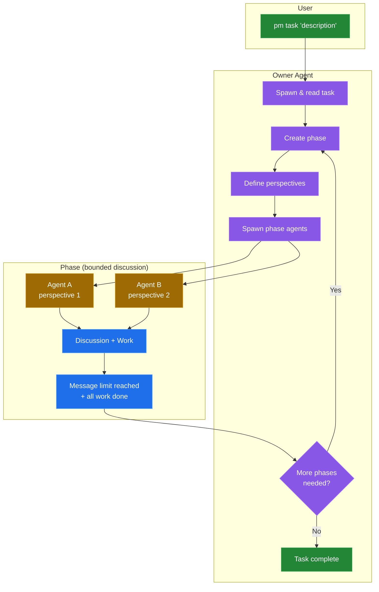
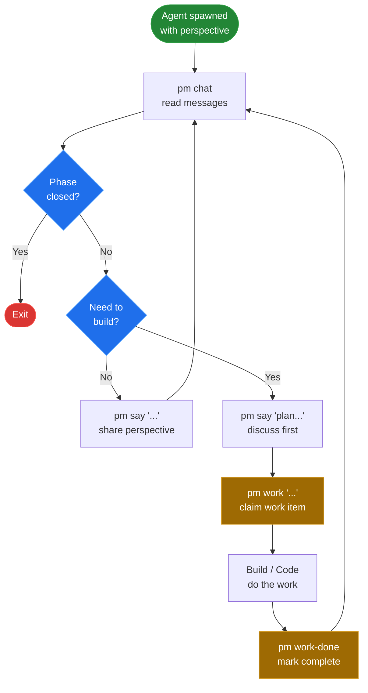

# Plasmodium Flowcharts

## System Flow

Task lifecycle from creation to completion.

## Phase Agent Flow

Decision loop for agents within a phase.

## Legend

| Color | Meaning |
|-------|---------|
| 🟢 Green | Start/End |
| 🟣 Purple | Owner actions |
| 🔵 Blue | Decisions / Phase |
| 🟠 Orange | Work items / Phase agents |
| ⬛ Gray | Actions |
